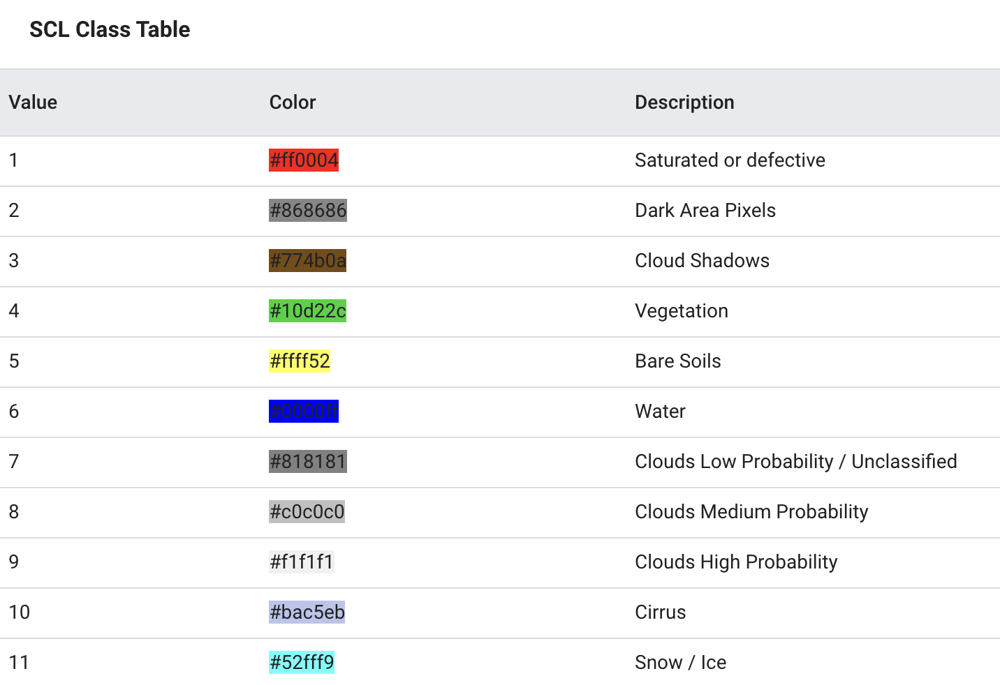

```{r, include = F}
knitr::opts_chunk$set(message = F, echo = F, error = F, warning = F)

packages <- c("tidyverse", "gt", "sf", "tmap")

package_loader <- function(x) {
    if (x %in% installed.packages()) {
      library(x, character.only = TRUE)
    } else {
      install.packages(x)
      library(x, character.only = TRUE)
    }
}

invisible(lapply(packages, package_loader))

model_version = "2024-04-26"

```

# Introduction

Remote sensing image classification is common in terrestrial applications (in
particular, land use and land cover), but has not been applied in aquatic
environments beyond general presence and absence of water and wetlands. The
primary exception to the use of image classification in aquatic environments is
assessing the presence of submerged aquatic vegetation ("SAV") (e.g.,
[@visser2018, @e.l.hestir2012]); however, these classification methods require
high resolution imagery with high spectral resolution often from land-based
high-resolution photography or unpersoned aerial vehicles ("UAVs").

In the Great Lakes (GL) region, much of the use of image classification is
completed using moderate resolution (e.g., Landsat, Sentinel, MODIS) satellite
images, focusing on mapping the distribution and types of wetlands throughout
the region ([@mohseni2023, @v.l.valenti2020]), as well as SAV distribution
throughout the system [@wolter2005]. Most of these analyses focus on a
relatively short temporal period (months to years), while a some span the entire
Landsat archive from the mid '80s through the recent past (e.g., [@amani2022]).

In the recent past, much attention has been paid to the apparent proliferation
of algal blooms in some of the clearest lakes, including Lake Superior (cite).
While detecting algal blooms from moderate-resolution satellite imagery is
difficult due to low temporal revisit frequency, time of day of acquisition,
pixel size, and spectral band metrics (cite), as well as the lack of observed,
spatially-explicit bloom observations to validate presence and absence, visually
detecting sediment plumes (which often precede algal blooms) is relatively easy
with just the red, green, and blue bands common on nearly all
moderate-resolution satellites.

In this analysis, we use the Landsat Collection 2 Surface Reflectance product
archive (missions 5 through 9, [@vermote2016, @masek2006]) and the Sentinel 2
Surface Reflectance product archive [@drusch2012], a novel crowd-sourced label
data set (eePlumB), and Google Earth Engine to create image classification
models to create a time series of rasters that enumerate sediment plumes across
the western arm of Lake Superior.

```{r fig-aoi, fig.dpi = 300, fig.align="center", fig.width=2, fig.height=1}
aoi <- read_sf("data/aoi/Superior_AOI_modeling.shp") %>%
  st_make_valid()

tmap_mode("view")
tm_basemap("CartoDB.Positron") +
  tm_shape(aoi) + tm_polygons(col = "#b97eea", alpha = 0.5) +
  tm_scale_bar()

```

:"Area of interest for this analysis in purple, consisting of a portion the
western extent of Lake Superior, the Apostle Islands, and Chequamegon Bay."

# Methods

## eePlumB

```{r echo=FALSE}
labels <- read_csv("data/labels/collated_label_data_v2023-07-20.csv") %>% 
  mutate(missDate = paste(mission, date, sep = "_"))
mod_labels <- labels %>% 
  filter(class %in% c("openWater", "cloud", "lightNearShoreSediment", "darkNearShoreSediment", "offShoreSediment"))
tvt_files <- list.files("data/labels/", pattern = "tvt", full.names = T)
for_tvt <- map(.x = tvt_files,
               .f = ~ read_rds(.x)) %>% 
  bind_rows()
```

Using the overarching architecture presented in the Global Rivers Obstruction
Database (GROD) [@yang2022] to engage volunteer observers, we crowdsourced class
labels for Landsat and Sentinel-2 images for the following classes: 'cloud',
'open water', 'light near shore sediment', 'dark near shore sediment', 'offshore
sediment', 'shoreline contamination', 'other', and 'algae bloom' using our Earth
Engine Plume and Bloom labeling interface ("eePlumB"). Dates for labeling were
limited to the months of April through November to avoid ice-on. During 2023,
`r length(unique(labels$vol_init))` volunteers labeled
`r length(unique(labels$missDate))` images resulting in a total of
`r nrow(labels)` labels within these classes. When the label set was limited to
open water, cloud, and sediment classes, `r nrow(mod_labels)` labels remained.

Though the eePlumB architecture was based on GROD, a major difference between
the two applications was GROD labeled the most recent cloud-free image, and in
eePlumB, we wanted to label multiple images across many satellites. This
required a bit more volunteer savvy in the eePlumB module. Because eePlumb was
not robustly designed for user experience, it was possible to export label data
that did not match the user-entered mission or date if the directions were not
followed precisely. In order to assure that the volunteer data were valid, we
re-pulled the data based on the volunteer-exported mission, date, and lat/lon
values. In order to provide verified data for band values across the open water
and sediment categories, numerous quality checks were performed:

1.  Any label that contained band names that were not part of the mission listed
    were automatically dismissed (e.g. if a Landsat 5 image listed B6, which is
    a thermal band and not exported as part of the Landsat 5 stack, the instance
    was removed)

2.  If the volunteer-pulled band value did not match the re-pull value for a
    majority of the labels in a given mission date, the mission date was
    dismissed

3.  Labels that were flagged by the Landsat or Sentinel QA bands and bits were
    dismissed (see Table XXX below for QA pixel masks)

4.  Labels belonged to a scene where there was scene-level contamination (cirrus
    clouds or atmospheric correction issues visible).

Any remaining extreme outlier in these classes (defined as \> 1.5\*IQR per band
per class) was retained if it was not dismissed in the above steps. Rendered
code (as .htmls) detailing these decisions is available in the Superior Plume
Bloom repository in the sub directory `modeling`, scripts 01-06. Generally
speaking, all cloud labels were kept as long as the pixel would not have been
masked as 'saturated' (QA_RADSAT == 0 for cloud label to be retained).

After the QA steps, `r nrow(for_tvt)` labels remained, Table 1 details the
remaining labels for building our classification models.

```{r echo=FALSE}
mission_class_summary <- for_tvt %>% 
  group_by(mission, class) %>% 
  summarize(n_labels = n()) %>% 
  pivot_wider(names_from = "class", values_from = "n_labels")  %>% 
  rename(`dark near shore sediment` = darkNearShoreSediment,
         `light near shore sediment` = lightNearShoreSediment,
         `off shore sediment` = offShoreSediment,
         `open water` = openWater)
mission_date_summary <- for_tvt %>% 
  group_by(mission) %>% 
  summarize(`number of unique dates` = length(unique(date)))
mission_summary <- full_join(mission_date_summary, mission_class_summary)
gt(mission_summary) %>%
  cols_align(., 'center', columns = 2:ncol(mission_summary)) %>% 
  tab_footnote('Table 1. Summary of eePlumB classes per mission after validity check (version 2024-04-25).')
```

## Model development

We used the built-in gradient tree boost ("GTB") ee.Classifier() method within
Google Earth Engine to create classification models from the crowd-sourced label
data. Image-dates for each mission were split randomly 70%/30% training and
testing, except Landsat 9 data which required manual selection of the test set
such that all classes were present in both the training and testing data sets
due to the limited number of dates available for the Landsat 9 mission. We did
not tune the hyper parameters for the GTB model, electing to use default
settings and 10 trees (a conservative number of trees). Since the GTB classifier
does not require validation data to build a model, we did not attempt to tune
hyper parameters, nor did we have sufficient data for a train-val-test split
that it was acceptable to use only a train-test split. After a model was
trained, it was applied to the image stack.

GTB models for each mission were trained independently on the rescaled band data
(0-1 values) from all available surface reflectance bands to classify the 5
categories: cloud, open water, light near shore sediment, dark near shore
sediment, and offshore sediment. In addition to the 5-category classification,
we trained a 3-class model. Preliminary data analysis revealed that there were
classes in the 5-class group that were not statistically different from one
another on an individual band basis (see the rendered .html 02-06 in the
modeling subdirectory of the repository). While it was likely that multiple band
interactions could have rendered these non-differences obsolete, we wanted to
test the performance if we only classified open water, cloud, and sediment
(reclassified from all three sediment classes).

## Image classification

### Image Pre-processing

Mosaic-ed images were made for each mission-date as mean band values where any
two path row or tiles overlapped. Sentinel-2 bands that had a pixel resolution
greater than 10m x 10m were resampled (downsampled) to 10m x 10m pixel sizes so
that the GTB model could be applied to the composite images more efficiently.

Pixel masking was slightly different for each mission. The following metadata
and pixel masks were applied to the stack to create the most conservative raster
output. All stacks were limited to the months of April-November to align with
the label data.

-   Landsat 5 and 7

    -   Scene-level filters: CLOUD_COVER \< 80, IMAGE_QUALITY \>= 7

    -   Pixel-level filters: SR_ATMOS_OPACITY \< 0.3 (only low opacity),
        QA_PIXEL bits 8-9 \< 3, 10-11\< 3, 12-13 \< 3, 14-15 \< 3 (masking
        high-confidence cirrus clouds, snow/ice, cloud shadows, and clouds),
        QA_RADSAT = 0 (all bands must be unsaturated)

-   Landsat 8 and 9

    -   Scene-level filters: CLOUD_COVER \< 80, IMAGE_QUALITY \>= 7

    -   Pixel-level filters: SR_QA_AEROSOL bits 6-8 \< 3 (masking
        high-confidence aerosol), QA_PIXEL bits 8-9 \< 3, 10-11\< 3, 12-13 \< 3,
        14-15 \< 3 (masking high-confidence cirrus clouds, snow/ice, cloud
        shadows, and clouds), QA_RADSAT = 0 (all bands must be unsaturated)

-   Sentinel 2A/2B

    -   Scene-level filters: CLOUDY_PIXEL_PERCENTAGE \< 80, GENERAL_QUALITY =
        'PASSED', GEOMETRIC_QUALITY = PASSED, SENSOR_QUALITY = 'PASSED',
        DEGRADED_MSI_DATA_PERCENTAGE = 0, SNOW_ICE_PERCENTAGE = 0

    -   Pixel-level filters: SCL != c(1, 2, 3, 9, 9, 10, 11), QA60 bit 10 = 0
        (masking opaque clouds), bit 11 = 0 (masking cirrus clouds)

        

Three areas of interest (AOIs) were used in this analysis: the complete AOI, the
AOI without shoreline contamination, and the AOI with shoreline contamination.
The area of shoreline contamination was defined as any area within 60 meters of
a volunteer-identified pixel with shoreline contamination. We assumed that
shoreline contamination was consistent throughout the analysis and was not
specific to any particular satellite or time period (see
`modeling/07_Shoreline_Contamination.html`).

### Model application and summaries

Each GTB model was applied to the corresponding satellite image stack and two
data types were output: a tabular data summary of the area classified and the
total area of each class for all three AOIs, as well as a .tif raster at the
resolution the GTB was applied (10m for Sentinel-2 and 30m for Landsat) for each
classified mission-date image. The .tif rasters were labeled by pixel with the
following values: 0 = out of area/masked for saturated pixels; 1 = cloud; 2 =
open water; 3 = light, near shore sediment; 4 = offshore sediment; 5 = dark,
near shore sediment.

## Model evaluation metrics

Models were evaluated through error matrices, kappa statistics, and F1
statistics for each class.

-   error matrix - testing: given the test data, does the model assign the
    correct class? These are tibble-style summaries where the model-assigned
    class and label class are compared.
-   kappa statistic: an indicator of how much better or worse a model performs
    than by random chance. score is -1 to 1, where 0 is the same as random
    chance, positive values are better than random chance and negative are
    poorer than random chance
-   F1 score: the harmonic mean of precision and recall per class (beta = 1,
    hence F1 where precision and recall are evenly weighted). Scores of 0 means
    the model cannot predict the correct class, a score of 1 means the model
    perfectly predicts the correct class.

Models were evaluated as 5-class categories and 3-class categories where all
sediment categories were compiled into a single class.

# Results

## Label dataset

```{r, include = F, echo = F, eval=F}
ml_labels = c('cloud', 'openWater', 'darkNearShoreSediment', 'lightNearShoreSediment', 'offShoreSediment')
# load labels
labels <- read_csv('data/labels/collated_label_data_v2023-07-20.csv')
only_ml_labels <- labels %>%
  filter(class %in% ml_labels)
filtered_labels <- read_csv('data/labels/collated_label_data_filtered_v2023-07-20.csv')
label_table <- labels %>%
  group_by(mission, class) %>%
  tally() %>%
  pivot_wider(names_from = mission, values_from = n) %>%
  rename('Landsat 5 (all)' = 'LS5',
         'Landsat 7 (all)' = 'LS7',
         'Landsat 8 (all)' = 'LS8',
         'Landsat 9 (all)' = 'LS9',
         'Sentinel-2 (all)' = 'SEN2')

filtered_label_table <- filtered_labels %>%
  group_by(mission, class) %>%
  tally() %>%
  pivot_wider(names_from = mission, values_from = n) %>%
  rename('Landsat 5 (filtered)' = 'LS5',
         'Landsat 7 (filtered)' = 'LS7',
         'Landsat 8 (filtered)' = 'LS8',
         'Landsat 9 (filtered)' = 'LS9',
         'Sentinel-2 (filtered)' = 'SEN2')

label_table_join <- full_join(label_table, filtered_label_table)
```

The collated crowdsourced label dataset consisted of `r nrow(labels)` labels
across all classes. There were `r nrow(ml_labels)` labels that were part of the
classes of interest (cloud, open water, sediment). After filtering for outliers
from each subset of mission-specific labels, there were
`r nrow(filtered_labels)` labels with complete band information. Table 1
presents a break down of the labels.

```{r, echo = F}
gt(label_table_join) %>%
  cols_align(., 'center', columns = c('Landsat 5 (all)':'Sentinel-2 (filtered)')) %>%
  tab_spanner('all labels',
              c('Landsat 5 (all)':'Sentinel-2 (all)')) %>%
  tab_spanner('filtered for model development and testing',
              c('Landsat 5 (filtered)':'Sentinel-2 (filtered)')) %>%
  tab_style(cell_text(size = 'small'), cells_body()) %>%
  tab_style(cell_text(size = 'small'), cells_column_labels()) %>%
  tab_footnote('Table 2. Summary of eePlumB classes per mission (version 2023-07-20). All labels (left group) are the raw number of collated labels, the right group are labels that have been filtered as described.')
```

```{r, include = F, echo = F, eval=F}
mission_date_summary <- labels %>%
  group_by(mission, date) %>%
  tally()
mission_date_summary_filtered <- filtered_labels %>%
  group_by(mission, date) %>%
  tally()
md_summ_table <- mission_date_summary %>%
  group_by(mission) %>%
  tally() %>%
  rename('unique mission-dates (all)' = 'n')
md_summ_table_filt <- mission_date_summary_filtered  %>%
  group_by(mission) %>%
  tally() %>%
  rename('unique mission-dates (filtered)' = 'n')

summary_table_join <- full_join(md_summ_table, md_summ_table_filt)
```

Labels were present from `r nrow(mission_date_summary)` individual mission-date
combinations spanning the dates of `r min(mission_date_summary$date)` to
`r max(mission_date_summary$date)`. Labels in the filtered dataset were present
from `r nrow(mission_date_summary_filtered)` mission-date combinations spanning
the dates `r min(mission_date_summary_filtered$date)` to
`r max(mission_date_summary_filtered$date)`. See Table 2 for a complete
breakdown of labels by mission-date combination.

```{r, echo = F, eval=FALSE}
gt(summary_table_join) %>%
  cols_align(., 'center', columns = c('unique mission-dates (all)', 'unique mission-dates (filtered)')) %>%
  tab_style(cell_text(size = 'small'), cells_body()) %>%
  tab_style(cell_text(size = 'small'), cells_column_labels()) %>%
  tab_footnote('Table 3. Summary of eePlumB mission-dates present in the label dataset. When filtered for ouliers, only two mission-dates, both Landsat 5 images, were lost from the dataset.')
```

## Model evaluation

Models performance was acceptable across open water, cloud, and discrete
sediment categories. All statistics presented in this section represent summary
statistics for classes from the testing set. Kappa statistic across all missions
was always greater than 0.8, indicating much better performance than random
assignment (Table 4). The F1 score, balanced equally between precision and
recall, was reasonable across all categories and missions with the minimum F1
score being 0.62 for "dark near-shore sediment" for Landsat 7 (Table 4). Cloud
and open water classification F1 scores were always greater than 0.86 (Table 4).

```{r, echo = F, eval=F}
# get a list of the performance metrics list
perf_metrics_list <- list.files("data/output/",
                                pattern = "_performance_stats.csv",
                                full.names = T)
# filter for only those for the desired model version
perf_metrics_list <- perf_metrics_list[grepl(model_version, perf_metrics_list)]

perf_metrics <- map_dfr(perf_metrics_list, read_csv) %>%
  #drop accuracy, since it's not meaningful for uneven groups
  select(-GTB_accuracy) %>%
  mutate(across(c(cloud:GTB_kappa),
                ~ round(., 2))) %>%
  rename("cloud" = "cloud",
         "open water" = "openWater",
         "light near-shore sediment" = "lightNearShoreSediment",
         "off-shore sediment" = "offShoreSediment",
         "dark near-shore sediment" = "darkNearShoreSediment",
         "model kappa statistic" = "GTB_kappa")
gt(perf_metrics) %>%
  cols_align(., 'center', columns = c("cloud":"model kappa statistic")) %>%
  tab_spanner("classification F1 score",
              c("cloud":"dark near-shore sediment")) %>%
  tab_style(cell_text(size = 'small'), cells_body()) %>%
  tab_style(cell_text(size = 'small'), cells_column_labels()) %>%
  tab_footnote('Table 4. Summary of F1 scores per class and across-class kappa statisic for the GTB model.')
```

When the sediment classes were aggregated to a single sediment class, F1 scores
and the kappa statistic increased dramatically (Table 5).

```{r echo = F, eval=F}
# load confusion files
confusion_files <- list.files("data/output",
                              pattern = c(model_version),
                              full.names = T)
confusion_files <- confusion_files[!grepl("performance", confusion_files)]
confusion_files <- confusion_files[!grepl("training", confusion_files)]
# and read them in
confusion <- map_dfr(confusion_files, read_csv)
# and re-org them with simplified sediment classes
confusion_simple <- confusion %>%
  mutate(new_class = if_else(grepl("sed", class, ignore.case = T),
                             "sediment",
                             class)) %>%
  group_by(new_class, mission) %>%
  summarize(across(c(cloud:darkNearShoreSediment),
                   ~ sum(.))) %>%
  pivot_longer(cols = c(cloud:darkNearShoreSediment),
               names_to = 'class_pred',
               values_to = 'n_pred') %>%
  mutate(new_class_pred = if_else(grepl("sed", class_pred, ignore.case = T),
                             "sediment",
                             class_pred)) %>%
  group_by(new_class, new_class_pred, mission) %>%
  summarize(n = sum(n_pred)) %>%
  pivot_wider(names_from = "new_class_pred",
              values_from = "n")

# now calculate F1 score and kappa statistic.
# precision = true positive /(true pos + false positives)
precision_simple <- confusion_simple %>%
  mutate(precision_cloud = cloud/(cloud + openWater + sediment),
         precision_water = openWater/(cloud + openWater + sediment),
         precision_sediment = sediment/((cloud + openWater + sediment))) %>%
  mutate(precision = case_when(new_class == "cloud" ~ precision_cloud,
                               new_class == "openWater" ~ precision_water,
                               new_class == "sediment" ~ precision_sediment)) %>%
  select(new_class, mission, precision)

# recall = true positive /(true pos + false neg)
recall_simple <- confusion_simple %>%
  pivot_longer(cols = c("cloud":"sediment"),
               names_to = "new_class_pred",
               values_to = "count") %>%
  pivot_wider(names_from = "new_class",
              values_from = "count") %>%
  mutate(recall_cloud = cloud/(cloud + openWater + sediment),
         recall_water = openWater/(cloud + openWater + sediment),
         recall_sediment = sediment/((cloud + openWater + sediment))) %>%
  mutate(recall = case_when(new_class_pred == "cloud" ~ recall_cloud,
                               new_class_pred == "openWater" ~ recall_water,
                               new_class_pred == "sediment" ~ recall_sediment)) %>%
  select(new_class = new_class_pred,
         mission, recall)

# F1 score = 2 * (precision*recall)/(precision+recall)
summary_simple = full_join(precision_simple, recall_simple) %>%
  mutate(f1score = 2*precision*recall/(precision+recall)) %>%
  select(mission, new_class, f1score)

# kappa statistic = observed accuracy - expected accuracy / 1 - expected accuracy
# observed accuracy = number of correct labels / total number of labels
observed_accuracy = confusion_simple %>%
  group_by(mission) %>%
  mutate(total_labels = sum(across(cloud:sediment))) %>%
  pivot_longer(cols = c(cloud:sediment),
               names_to = "new_class_pred",
               values_to = "count") %>%
  filter(new_class == new_class_pred) %>%
  group_by(mission, total_labels) %>%
  summarize(count_correct = sum(count)) %>%
  mutate(accuracy = count_correct/total_labels)

# expected accuracy = sum of marginal frequencys across all classes / total labels
# marginal frequency = actual number of labels correct * predicted number of labels correct / total labels
expected_accuracy = confusion_simple %>%
  mutate(actual_correct = cloud + openWater + sediment) %>%
  pivot_longer(cols = c(cloud:sediment),
               names_to = "new_class_pred",
               values_to = "count") %>%
  mutate(pred_correct = if_else(new_class == new_class_pred,
                                  count,
                                  NA_real_)) %>%
  filter(!is.na(pred_correct)) %>%
  left_join(observed_accuracy) %>%
  mutate(marginal_frequency = actual_correct*pred_correct/total_labels) %>%
  ungroup() %>%
  select(mission, marginal_frequency) %>%
  group_by(mission) %>%
  slice(1) %>%
  left_join(observed_accuracy) %>%
  mutate(expect_acc = sum(marginal_frequency)/total_labels)

kappa = expected_accuracy %>%
  mutate(kappa = (accuracy - expect_acc)/(1-expect_acc)) %>%
  select(mission, kappa)

summary_simple <- summary_simple %>%
  pivot_wider(names_from = "new_class",
              values_from = "f1score") %>%
  full_join(kappa) %>%
  mutate(across(cloud:kappa,
                ~ round(., 2))) %>%
  rename("model kappa statistic" = "kappa",
         "open water" = "openWater")
```

```{r echo = F, eval = F}
gt(summary_simple) %>%
  cols_align(., 'center', columns = c("cloud":"model kappa statistic")) %>%
  tab_spanner("classification F1 score",
              c("cloud":"sediment")) %>%
  tab_style(cell_text(size = 'small'), cells_body()) %>%
  tab_style(cell_text(size = 'small'), cells_column_labels()) %>%
  tab_footnote('Table 4. Summary of F1 scores per class and across-class kappa statisic for the GTB model with simplified sediment category.')
```

# Discussion

The GTB model was applied to all images in the Landsat and Sentinel 2 stacks,
irregardless of time of year and presence/absence of ice. Classified images
should only be used during ice-free periods, as no attempt was made to mask ice
or to classify ice. It is important to note that evaluation of the GTB model was
only done on the available by-pixel labels and that accuracy at classification
edges may not be precise.

In many cases, cirrus clouds are incorrectly classified as off-shore sediment.
Caution should be used when clouds characterize a large proportion of the AOI.

# Image Viewer Links

The following links are Google Earth Engine scripts that allow for manual
examination of the true color image, the eePlumB classification (version
2024-01-08), and a measure of atmospheric opacity (Landsat 5/7) or cirrus cloud
confidence level (Landsat 8 & 9). For Sentinel 2, the cirrus cloud indication is
a 0 (no cirrus detected) 1 (cirrus detected) value.

[Landsat
5](https://code.earthengine.google.com/3dc621a541fefa6db53e874646f93b13)

[Landsat
7](https://code.earthengine.google.com/83427128adac071d119edbd3a86f1127)

[Landsat
8](https://code.earthengine.google.com/f4aad47222c53d6cf7510ef3e3344119)

[Landsat
9](https://code.earthengine.google.com/f2983f2a2196a2c033afacd22471e398)

[Sentinel
2A](https://code.earthengine.google.com/c8ae30202ad9e2549f009babe736497c)

[Sentinel
2B](https://code.earthengine.google.com/31d9b913a8421091447f213ef6d1db6d)

Note, the Sentinel viewers may hang shortly before displaying the date list.
Landsat 5 and 7 opacity measure does not seem robust for detecting cirrus
clouds. More investigation is needed to determine cirrus cloud contamination in
those instances.

# References
