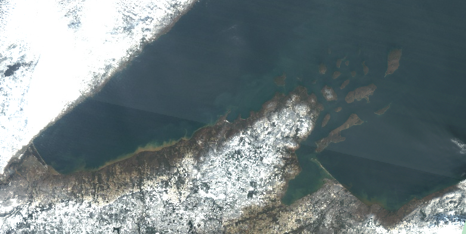
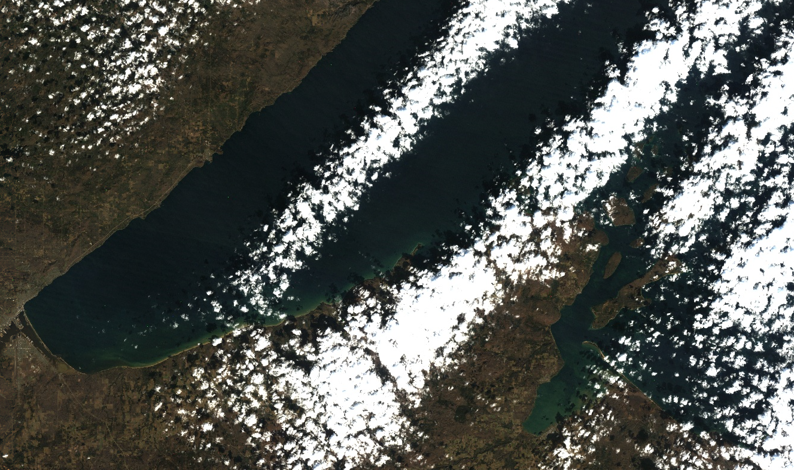
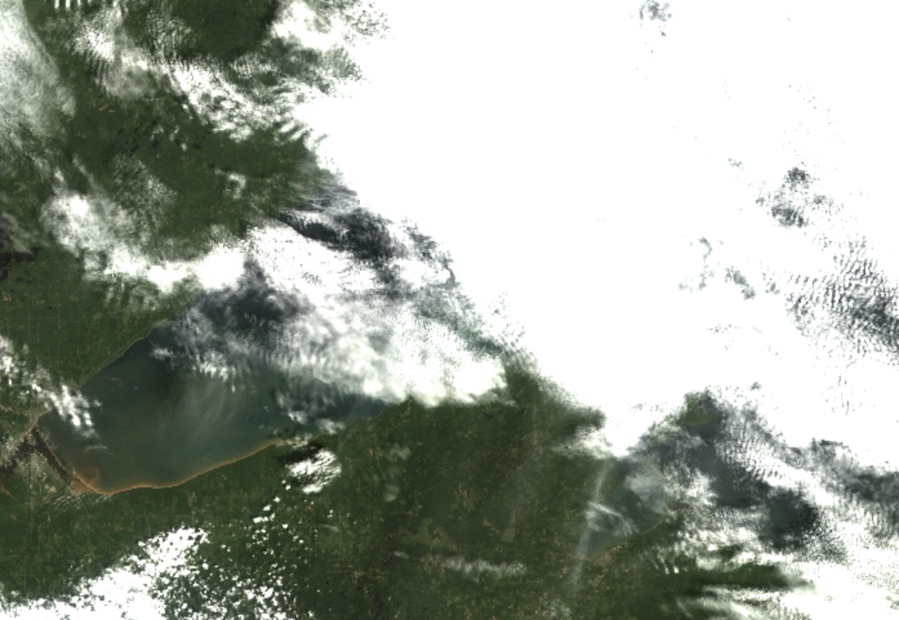

```{r setup, echo = F, message = FALSE}
# keep things quiet
knitr::opts_chunk$set(message = FALSE, error = FALSE, warning = FALSE, fig.dim = c(4,4))

# get all the functions from the src folder and load them
source_files <- list.files("src", full.names = T)
invisible(lapply(source_files, source))
# and the funcs for this analysis
analysis_funcs <- list.files("modeling/src", full.names = T)
invisible(lapply(analysis_funcs, source))
# list/load/download the packages needed for this script
packages <- c('rstatix',
              'tidyverse',
              'ggthemes',
              'GGally',
              'knitr')
invisible(lapply(packages, package_loader))
```

# Purpose

This script takes a deep dive into Landsat 5 labels for a more rigorous analysis
of inconsistent band data and outliers in the filtered label dataset. Here we
will determine if any more label data points should be removed from the training
dataset and whether or not we can glean anything from the metadata in the
outlier dataset to be able to pre-emptively toss out scenes when we go to apply
the classification algorithm.

```{r}
harmonize_version = "v2024-04-24"
outlier_version = "v2024-04-25"

LS5 <- read_rds(paste0("data/labels/harmonized_LS57_labels_", harmonize_version, ".RDS")) %>% 
  filter(mission == "LANDSAT_5")
```

## Check for mis-matched band data between user data and re-pull

Just look at the data to see consistent (or inconsistent) user-pulled data and
our pull, here, our user data are in "BX" format and the re-pull is in "SR_BX"
format. These are steps to assure data quality if the volunteer didn't follow
the directions explicitly.

```{r, echo=FALSE}
pmap(.l = list(user_band = LS57_user,
               ee_band = LS57_ee,
               data = list(LS5),
               mission = list("LANDSAT_5")),
     .f = make_band_comp_plot)
```

There is some mis-match here, let's look at those data, in this case, we'll just
use B7/SR_B7 as a reference to filter inconsistent labels

```{r}
LS5_inconsistent <- LS5 %>% 
  filter(is.na(SR_B7) | !between(B7, SR_B7-0.001, SR_B7+0.001))

LS5_inconsistent %>% 
  group_by(class) %>% 
  summarise(n_labels = n()) %>% 
  kable()
```

It looks like most of these of these are pixels that were saturated and masked out in the
re-pull.

```{r}
LS5_inconsistent %>% 
  filter(!is.na(SR_B7)) %>% 
  nrow()
```

Let's see if there is any consistent scene that these values are different:

```{r}
LS5_inconsistent %>% 
  filter(!is.na(SR_B7)) %>% 
  group_by(date, vol_init) %>% 
  summarise(n_labels = n()) %>% 
  arrange(-n_labels)

```


And plot:

```{r, echo=FALSE}
pmap(.l = list(user_band = LS57_user,
               ee_band = LS57_ee,
               data = list(LS5_filtered),
               mission = list("LANDSAT_5")),
     .f = make_band_comp_plot)
```

There's still a couple of mis-matched data points in here, seen in B3, so we'll
put those over into inconsistent, too.

```{r}
LS5_inconsistent <-  LS5_filtered %>% 
  filter(!between(B4, SR_B4+0.001, SR_B4-0.001)) %>% 
  bind_rows(., LS5_inconsistent)
LS5_filtered <- LS5_filtered %>% 
  filter(B4 == SR_B4) 
```

And now let's look at the data by class:

```{r, echo=FALSE}
pmap(.l = list(data = list(LS5_filtered),
               data_name = list("LANDSAT_5"),
               band = LS57_ee),
     .f = make_class_comp_plot)
```

We aren't actually modeling "other" (not sufficient observations to classify) or
"shorelineContamination" (we'll use this later to block areas where there is
likely shoreline contamination in the AOI), so let's drop those categories and
look at the data again.

```{r}
LS5_for_class_analysis <- LS5_filtered %>% 
  filter(!(class %in% c("other", "shorelineContamination")))
```

```{r, echo=FALSE}
pmap(.l = list(data = list(LS5_for_class_analysis),
               data_name = list("LANDSAT_5"),
               band = LS57_ee),
     .f = make_class_comp_plot)
```

### Check for systemic volunteer inconsistencies

Let's also go back and check to see if there is any pattern to the inconsistent
labels.

```{r, echo = FALSE}
LS5_inconsistent %>% 
  group_by(vol_init) %>% 
  summarise(n_tot_labs = n(),
            n_dates = length(unique(date))) %>% 
  arrange(-n_dates) %>% 
  kable()
```

There seem to be just a few inconsistencies here and across multiple dates. This
could just be a processing difference (if there happened to be an update to a
scene since users pulled these data or if these were on an overlapping portion
of two scenes). I'm not concerned about any systemic errors here that might
require modified data handling for a specific scene or contributor.

## Outlier handling

There are statistical outliers within this dataset and they may impact the
interpretation of any statistical testing we do. Let's see if we can narrow down
when those outliers and/or glean anything from the outlier data that may be
applicable to the the application of the algorithm. Outliers may be a systemic
issue (as in the scene is an outlier), it could be a user issue (a user may have
been a bad actor), or they just might be real. This section asks those
questions. The "true outliers" that we dismiss from the dataset will also be
used to help aid in interpretation/application of the algorithm across the
Landsat stack, so it is important to make notes of any patterns we might see in
the outlier dataset.

```{r, echo=FALSE}
vertical_data <- LS5_for_class_analysis %>% 
  pivot_longer(LS57_ee,
             names_to = "band_name",
             values_to = "value") %>% 
  rowid_to_column()
vert_out <- vertical_data %>% 
  select(user_label_id, rowid, date, class, band_name, value, vol_init) %>% 
  group_by(class, band_name) %>% 
  identify_outliers(., value) %>% 
  filter(is.extreme)
outliers <- vert_out  %>% 
  left_join(vertical_data) %>%
  select(-rowid)%>% 
  pivot_wider(names_from = band_name,
              values_from = value,
              values_fn = max)

print("Classes represented in outliers:")
unique(outliers$class)
```

Okay, `r nrow(outliers)` of extreme outliers (\>1.5\*IQR) out of
`r nrow(LS5_for_class_analysis)` total labels - and they are all from non-cloud
groups.

### Systemic contributor/scene errors

Are there any contributors that show up more than others in the outliers
dataset?

```{r, echo = FALSE}
LS5_vol <- LS5_for_class_analysis %>% 
  filter(class != "cloud") %>% 
  group_by(vol_init) %>% 
  summarise(n_tot = n()) %>% 
  arrange(-n_tot)
LS5_out_vol <- outliers %>% 
  group_by(vol_init) %>% 
  summarise(n_out = n()) %>% 
  arrange(-n_out)
full_join(LS5_vol, LS5_out_vol) %>% 
  mutate(percent_outlier = round(n_out/n_tot*100,1)) %>% 
  arrange(-percent_outlier) %>% 
  kable()
```

These aren't terrible. At/below 10%, nothing egregious.

How many of these outliers are in specific scenes?

```{r, echo=FALSE}
LS5_out_date <- outliers %>% 
  group_by(date, vol_init) %>% 
  summarize(n_out = n())
LS5_date <- LS5_for_class_analysis %>% 
  filter(class != "cloud") %>% 
  group_by(date, vol_init) %>% 
  summarise(n_tot = n())
LS5_out_date <- left_join(LS5_out_date, LS5_date) %>% 
  mutate(percent_outlier = round(n_out/n_tot*100,1)) %>% 
  arrange(-percent_outlier)

kable(LS5_out_date)
```

There are two scenes here that have very high outliers (\> 20% of total
labels) - perhaps there is something about the AC in these particular scenes? or
the general scene quality? Let's look at the scene-level metadata:

```{r, echo=FALSE}
LS5_out_date %>% 
  filter(percent_outlier > 20) %>% 
  select(date, vol_init) %>% 
  left_join(., LS5) %>% 
  select(date, vol_init, DATA_SOURCE_AIR_TEMPERATURE:max_cloud_cover) %>% 
  distinct() %>% 
  kable()
```

This isn't terribly helpful, there is a range of `IMAGE_QUALITY`, there are
ranges of `CLOUD_COVER`, otherwise metadata is basically the same (but to broad
to make a distinction for exclusion). While I feel fine dropping these two scenes
from the training dataset, we need a systematic way to make sure we don't apply
the algo to similar scenes. If there isn't anything common in the metadata, we
would need to mask pixels by band ranges that are present in the training set
(as those are the ones we have confidence in) or flag pixels that we aren't
confident in after the fact (because they are outside of the range used for the
training dataset).

How many bands are outliers when the data are aggregated back to label? If there
is a large portion of outliers amongst the RGB bands (how users labeled data),
there is probably a systemic problem. If the outliers are in singular bands,
especially those that are not in the visible spectrum, we can dismiss the
individual observations, and probably assert that the scene as a whole is okay
to use in training. First pass, if there are 3 or more bands deemed outliers for
a particular label, let's look at the bands that are outliers:

```{r, echo = FALSE}
vert_out %>%
  group_by(date, class, vol_init, user_label_id) %>% 
  summarise(n_bands_out = n(),
            bands_out = paste(band_name, collapse = "; ")) %>% 
  filter(n_bands_out >= 3) %>% 
  arrange(-n_bands_out) %>% 
  kable()
```

Let's group by image date and volunteer and tally up the number of labels where
at least 3 bands where outliers:

```{r, echo = FALSE}
vert_out %>%
  group_by(date, class, vol_init, user_label_id) %>% 
  summarise(n_bands_out = n(),
            bands_out = paste(band_name, collapse = "; ")) %>% 
  filter(n_bands_out >= 3) %>% 
  ungroup(class, user_label_id) %>% 
  summarise(n_labels = n()) %>% 
  arrange(-n_labels) %>% 
  kable()
```

At the very least, there are issues in the 1988-11-23 scene... but is that user
error? Atmospheric correction?



This looks super hazy, so that may be the issue with this particular scene.
Unfortunately, there is no way to know this from the scene metadata. The
SR_ATMOS_OPACITY value is low (this is supposed to indicate the skies are
clear), the cirrus confidence is low (but it's also low for a majority of the
labels in this dataset). Reanalysis for this, or dense dark vegetation
estimation for aerosol stand-in in LEDAPS may be the culprit - or it could be
something to do with surrounding bright snow-covered land that impacts the Rrs
values of pixels. This is probably a reason to avoid categorizing LS5 images
during winter months, and that bright snow along the shoreline may cause issues
with classification.

### QA Pixels

Do any of the labels have QA pixel indications of cloud or cloud shadow? The
first pass here is for all data that don't have a label of "cloud" (not just
outliers). Let's see if the medium certainty classification in the QA band is
useful here:

```{r}
LS5_for_class_analysis %>% 
  mutate(QA = case_when(str_sub(QA_PIXEL_binary, 1, 2) %in% c(10, 11)  ~ "cirrus",
                   str_sub(QA_PIXEL_binary, 3, 4) %in% c(10, 11)  ~ "snow/ice",
                   str_sub(QA_PIXEL_binary, 5, 6) %in% c(10, 11)  ~ "cloud shadow",
                   str_sub(QA_PIXEL_binary, 7, 8) %in% c(10, 11)  ~ "cloud",
                   TRUE ~ "clear")) %>% 
  group_by(QA) %>% 
  filter(class != "cloud") %>% 
  summarize(n_tot = n()) %>% 
  kable()
```

Well, that's not helpful, considering that most of the label dataset has at
least a medium confidence cloud QA flag as the pixel QA. Now with only high
confidence clouds:

```{r}
LS5_for_class_analysis %>% 
  mutate(QA = case_when(str_sub(QA_PIXEL_binary, 1, 2) == 11 ~ "cirrus",
                   str_sub(QA_PIXEL_binary, 3, 4) == 11 ~ "snow/ice",
                   str_sub(QA_PIXEL_binary, 5, 6)  == 11 ~ "cloud shadow",
                   str_sub(QA_PIXEL_binary, 7, 8)  == 11 ~ "cloud",
                   TRUE ~ "clear")) %>% 
  group_by(QA) %>% 
  filter(class != "cloud") %>% 
  summarize(n_tot = n()) %>% 
  kable()
```

Okay, if we use only "high confidence", this seems a little better. Let's look
at the labels where pixels were classified as snow/ice:

```{r}
LS5_snow_ice <- LS5_for_class_analysis %>% 
  filter(str_sub(QA_PIXEL_binary, 3, 4) == 11,
         class != "cloud") %>%
  group_by(date, vol_init) %>% 
  summarise(n_snow_ice = n()) %>% 
  arrange(-n_snow_ice)
LS5_tot <- LS5_for_class_analysis %>% 
  group_by(date, vol_init) %>% 
  filter(class != "cloud") %>% 
  summarise(n_tot_labels = n())
left_join(LS5_snow_ice, LS5_tot) %>% 
  mutate(percent_snow_ice = round(n_snow_ice/n_tot_labels*100, 1)) %>% 
  arrange(-percent_snow_ice) %>% 
  kable()
```

We don't want to be using data that's flagged as snow/ice nor are we going to
classify pixels that are snow/ice, so let's see what classes are represented in
the pixels with snow/ice QA designations. Let's look at that image on 1987-11-05
to see if there is visible ice:



I don't see instances of ice/snow here... I suspect that when the QA bit
misclassifies as snow/ice, there may be a systemic issue (maybe from the bright
clouds?) To be conservative, I think we should drop this scene, especially since
more than 50% of the labels have a snow/ice flag associated with them. I don't
believe that the QA pixel is used to assign atmospheric correction, so I think
only dropping the egregious one here is acceptable.

Let's also look at the cirrus flagged pixels:

```{r}
LS5_for_class_analysis %>% 
  filter(str_sub(QA_PIXEL_binary, 1, 2) == 11,
         class != "cloud") %>% 
  group_by(date, vol_init) %>% 
  summarise(n_cirrus = n()) %>% 
  arrange(-n_cirrus) %>% 
  left_join(., LS5_tot) %>% 
  mutate(percent_cirrus = round(n_cirrus/n_tot_labels*100, 1)) %>% 
  arrange(-percent_cirrus) %>% 
  kable() 
```

Let's look at the 1993-06-30 image:



Yeah, that looks pretty hazy to me! Let's get a reminder of what the metadata 
is for this scene:

```{r}
LS5_for_class_analysis %>% 
  filter(date == "1993-06-30") %>% 
  select(date, vol_init, DATA_SOURCE_AIR_TEMPERATURE:max_cloud_cover) %>% 
  distinct() %>% 
  kable()
```

Okay, I think the combination of lower image quality and high cloud cover here may
be meaningful. We should drop any labels that have a cirrus QA flag that aren't 
cloud labels, and be weary of scenes with high (> 60%) cloud cover and lower image
quality (< 9).

And now for the outliers:

```{r}
outliers %>% 
  mutate(QA = case_when(str_sub(QA_PIXEL_binary, 1, 2) == 11 ~ "cirrus",
                   str_sub(QA_PIXEL_binary, 3, 4) == 11 ~ "snow/ice",
                   str_sub(QA_PIXEL_binary, 5, 6)  == 11 ~ "cloud shadow",
                   str_sub(QA_PIXEL_binary, 7, 8)  == 11 ~ "cloud",
                   TRUE ~ "clear")) %>% 
  group_by(QA) %>% 
  filter(class != "cloud") %>% 
  summarize(n_out_tot = n()) %>% 
  kable()
```

Let's look into those cirrus QA bits:

```{r}
outliers %>% 
  filter(str_sub(QA_PIXEL_binary, 1, 2) == 11,
         class != "cloud") %>% 
  group_by(date, vol_init) %>% 
  summarise(n_out_cirrus = n()) %>% 
  arrange(-n_out_cirrus) %>% 
  kable()
```

And there is the 1993-06-30 image from earlier. Again, just toss the labels that
are flagged as cirrus from the QA bit.

### Clouds

How many of these outliers have near-pixel clouds (as measured by ST_CDIST)?

```{r, echo = FALSE}
LS5_out_CDIST <- outliers %>% 
  filter(ST_CDIST < 50) 
# compared with the whole dataset 
LS5_CDIST <- LS5_for_class_analysis %>% 
  filter(class != "cloud" & ST_CDIST < 50)
```

There are `r nrow(LS5_out_CDIST)` labels
(`r round(nrow(LS5_out_CDIST)/nrow(outliers)*100, 1)`% of oultiers) that aren't
"cloud" in the outlier dataset that have a cloud distance \<500m and
`r nrow(LS5_CDIST)` labels
(`r round(nrow(LS5_CDIST)/nrow(LS5_for_class_analysis)*100, 1)`%) in the whole
dataset that have a cloud distance \<500m. Since this is about the same portion
of labels (or they are not severely disproportionate), I don't think this is
terribly helpful.

How many of the outliers have high cloud cover, as reported by the scene-level
metadata? Note, we don't have the direct scene cloud cover associated with
individual labels, rather a list of the scene level cloud cover values
associated with the AOI.

```{r, echo = FALSE}
# max
LS5_out_max_cloud <- outliers %>% 
  rowwise() %>% 
  filter(max_cloud_cover > 75) %>% 
  pluck("CLOUD_COVER") %>% 
  unique()
# compared with the whole dataset 
LS5_max_cloud <- LS5_for_class_analysis %>% 
  rowwise() %>% 
  filter(class != "cloud" & max_cloud_cover > 75) 

# mean
LS5_out_mean_cloud <- outliers %>% 
  rowwise() %>% 
  filter(mean_cloud_cover > 60) 
# compared with the whole dataset 
LS5_mean_cloud <- LS5_for_class_analysis %>% 
  rowwise() %>% 
  filter(class != "cloud" & mean_cloud_cover > 60) 
```

The outlier dataset contains `r nrow(LS5_out_max_cloud)`
(`r round(nrow(LS5_out_max_cloud)/nrow(outliers)*100, 1)`%) where the max cloud
cover was \> 75% and `r nrow(LS5_out_mean_cloud)`
(`r round(nrow(LS5_out_mean_cloud)/nrow(outliers)*100, 1)`%) where the mean
cloud cover was \> 50%. The filtered dataset contains `r nrow(LS5_max_cloud)`
(`r round(nrow(LS5_max_cloud)/nrow(LS5_for_class_analysis)*100, 1)`%) where max
was \>75% and `r nrow(LS5_mean_cloud)`
(`r round(nrow(LS5_mean_cloud)/nrow(LS5_for_class_analysis)*100, 1)`%) where the
mean cloud cover was \> 50%. While there is a greater instance of higher
CLOUD_COVER in the outliers, it's not a large enough portion of the outlier
dataset to say that we should just toss scenes of either case above.

### RadSat QA bit

Pixels can also be saturated in one or more bands, we need to make sure that the
QA_RADSAT for all labels (including clouds) are set to zero. During the re-pull, 
we masked satruated pixels, so this should be zero.

```{r}
LS5_for_class_analysis %>% 
  mutate(radsat = if_else(QA_RADSAT == 0,
                           "n",
                           "y")) %>% 
  group_by(radsat) %>% 
  summarize(n_tot = n()) %>% 
  kable()
```

Great! No bands are saturated!

### Training dataset implications

For the purposes of training data, I think we can throw out the data from the
1988-11-23 and 1987-11-05 scenes, any non-cloud classes that are flagged as
snow/ice or cirrus. All other outliers should be retained, in my opinion.

```{r}
LS5_training_labels <- LS5_for_class_analysis %>% 
  filter(!(date %in% c("1988-11-23", "1987-11-05")),
         !(str_sub(QA_PIXEL_binary, 1, 2) == 11 & class != "cloud"),
         !(str_sub(QA_PIXEL_binary, 3, 4) == 11 & class != "cloud"))
```

## Testing for inter-class differences

We do want to have an idea of how different the classes are, in regards to band
data. While there are a bunch of interactions that we could get into here, for
the sake of this analysis, we are going to analyze the class differences by
band.

Kruskal-Wallis assumptions:

1)  Data are non-Normal or have a skewed distribution
2)  There must be at least two independent groups.
3)  Data have a similar distribution across groups.
4)  Data are independent, the groups shouldn't have a relationship to one
    another
5)  Each group should contain at least 5 observations

ANOVA assumptions:

1)  data are distributed normally
2)  data are independent
3)  variance across groups is similar

We can't entirely assert sample independence and we know that variance and
distribution is different for "cloud" labels, but those data also are visibly
different from the other classes.

In order to systematically test for differences between classes and be able to
intepret the data, we will need to know some things about our data:

1)  Are the data normally distributed (Shapiro-Wilkes)?
2)  Are there outliers that may impact interpretation?
3)  If data is non-normal, perform Kruskal-Walis test; otherwise ANOVA
4)  if the null is rejected (and there is a difference in at least one class),
    perform post-hoc test for pairwise comparison (Dunn test for both)

With this workflow, most classes are statistically different - below are the
cases where the pairwise comparison were not deemed statistically significant:

```{r, echo = FALSE}
LS57_band_sym = syms(LS57_ee)

LS5_class_analysis <- pmap(.l = list(dataset = list(LS5_training_labels),
                                     band = LS57_band_sym,
                                     class_col = list(sym("class"))),
                           .f = test_class_sig)
names(LS5_class_analysis) <- LS57_ee

map(LS5_class_analysis,
    function(band) {
      band$pairwise_difference %>% 
        filter(p.adj.signif == "ns")
    }
  ) %>% 
  list_rbind() %>% 
  rename(band = .y.)
```

There is some consistency here: "darkNearShoreSediment" is often not different
from other sediment types by band. It is entirely possible that band
interactions overpower these non-significant differences.

```{r, echo=FALSE, fig.dim=c(10,10), fig.cap="DNSS: dark near shore sediment, LNSS: light near shore sediment, OSS: offshore sediment"}
LS5_training_labels %>% 
  mutate(class_short = case_when(class == "darkNearShoreSediment" ~ "DNSS",
                                 class == "lightNearShoreSediment" ~ "LNSS",
                                 class == "offShoreSediment" ~ "OSS",
                                 TRUE ~ class)) %>% 
ggpairs(., columns = LS57_ee, aes(color = class_short)) + 
  scale_color_colorblind() +
  scale_fill_colorblind() +
  theme_few()
```

There are definitely some varying patterns here, let's zoom in on the sediment
classes.

```{r, echo=FALSE, fig.dim=c(8,8), fig.cap="DNSS: dark near shore sediment, LNSS: light near shore sediment, OSS: offshore sediment"}
LS5_training_labels %>% 
  mutate(class_short = case_when(class == "darkNearShoreSediment" ~ "DNSS",
                                 class == "lightNearShoreSediment" ~ "LNSS",
                                 class == "offShoreSediment" ~ "OSS",
                                 TRUE ~ class)) %>% 
  filter(grepl("Sediment", class)) %>% 
ggpairs(., columns = LS57_ee, aes(color = class_short)) + 
  scale_color_colorblind() +
  scale_fill_colorblind() +
  theme_few()
```

Okay, this seems sensical as to why there is no significant difference in many
of the band-level "darkNearShoreSediment" labels - there's a lot of overlap in
ranges. Looking at these scatter plot matrices, I do think there are likely
different enough patterns when considering multiple bands that ML should be able
to pick up on subtle differences.

## Export the training labels

Things to note for Landsat 5:

-   when neighboring land is covered in snow, it's possible that the Rrs data
    will be brighter than usual (but our n = 1 here, so this is more of a
    warning)

-   pixels with a QA bit of cirrus or snow/ice should be masked when applying
    the algorithm

-   a combination of higher cloud cover and lower image quality may be a reason
    to exclude a scene (again, n = 1)

```{r}
write_rds(LS5_training_labels, paste0("data/labels/LS5_labels_for_tvt_", outlier_version, ".RDS"))
```
