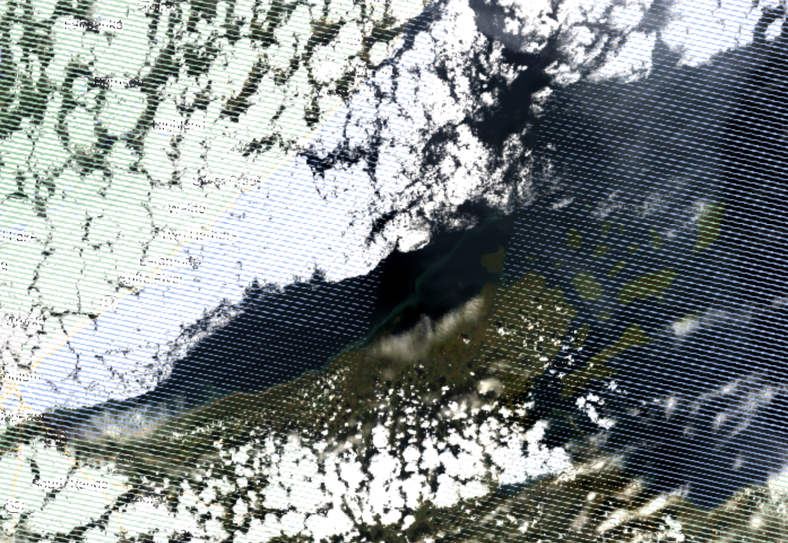
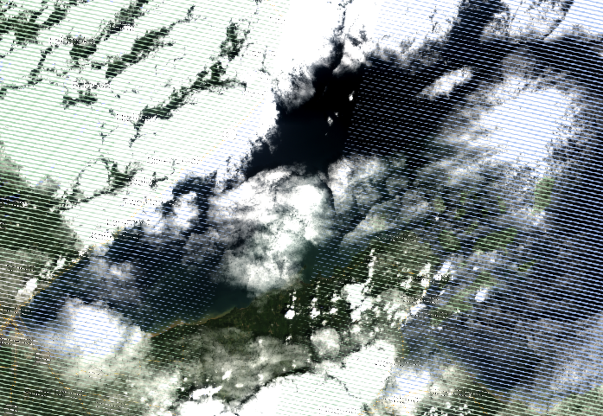
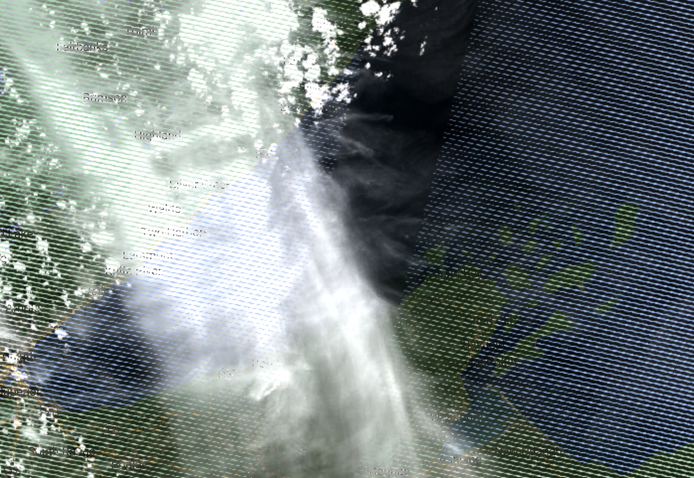

```{r setup, echo = F, message = FALSE}
# keep things quiet
knitr::opts_chunk$set(message = FALSE, error = FALSE, warning = FALSE, fig.dim = c(4,4))

# get all the functions from the src folder and load them
source_files <- list.files("src", full.names = T)
invisible(lapply(source_files, source))
# and the funcs for this analysis
analysis_funcs <- list.files("modeling/src", full.names = T)
invisible(lapply(analysis_funcs, source))
# list/load/download the packages needed for this script
packages <- c('rstatix',
              'tidyverse',
              'ggthemes',
              'GGally',
              'knitr')
invisible(lapply(packages, package_loader))
```

# Purpose

This script takes a deep dive into Landsat 7 labels for a more rigorous analysis
of inconsistent band data and outliers in the filtered label dataset. Here we
will determine if any more label data points should be removed from the training
dataset and whether or not we can glean anything from the metadata in the
outlier dataset to be able to pre-emptively toss out scenes when we go to apply
the classification algorithm.

```{r}
harmonize_version = "v2024-04-17"
outlier_version = "v2024-04-17"

LS7 <- read_rds(paste0("data/labels/harmonized_LS57_labels_", harmonize_version, ".RDS")) %>% 
  filter(mission == "LANDSAT_7")
```

## Check for mis-matched band data between user data and re-pull

Just look at the data to see consistent (or inconsistent) user-pulled data and
our pull, here, our user data are in "BX" format and the re-pull is in "SR_BX"
format. These are steps to assure data quality if the volunteer didn't follow
the directions explicitly.

```{r}
pmap(.l = list(user_band = LS57_user,
               ee_band = LS57_ee,
               data = list(LS7),
               mission = list("LANDSAT_7")),
     .f = make_band_comp_plot)
```

There is some mis-match here, let's look at those data, in this case, we'll just
use B7/SR_B7 as a reference to filter inconsistent labels

```{r}
LS7_inconsistent <- LS7 %>% 
  filter((is.na(SR_B7) | SR_B7 != B7))

LS7_inconsistent %>% 
  group_by(class) %>% 
  summarise(n_labels = n()) %>% 
  kable()
```

Most of these are cloud labels, where the pixel is saturated, and then masked in
the re-pull value (resulting in an NA). Let's drop those from this subset and
then look more.

```{r}
LS7_inconsistent <- LS7_inconsistent %>% 
  filter(!(class == "cloud" & is.na(SR_B7)))

```

This leaves `r round(nrow(LS7_inconsistent)/nrow(LS7)*100, 1)`% of the Landsat
7 labels as inconsistent. Let's do a quick sanity check to make sure that we've
dropped values that are inconsistent between pulls:

```{r}
LS7_filtered <- LS7 %>% 
  filter(# filter data where SR_B7 has data and where the values match between the two
         # pulls.
         (!is.na(SR_B7) & SR_B7 == B7) | 
           # or where the user-specified class is cloud and the pixel was saturated
           # providing no surface refelctance data
           (class == "cloud" & is.na(SR_B7)),
         # or where any re-pulled band value is greater than 1, which isn't a valid value
         if_all(LS57_ee,
                ~ . <= 1))
```

And plot:

```{r, echo=FALSE}
pmap(.l = list(user_band = LS57_user,
               ee_band = LS57_ee,
               data = list(LS7_filtered),
               mission = list("LANDSAT_7")),
     .f = make_band_comp_plot)
```

Still a few mis-matched visible in B5/SR_B5.

```{r}
LS7_inconsistent <-  LS7_filtered %>% 
  filter(B5 != SR_B5) %>% 
  bind_rows(., LS7_inconsistent)
LS7_filtered <- LS7_filtered %>% 
  filter(B5 == SR_B5) 
```

And now let's look at the data by class:

```{r, echo=FALSE}
pmap(.l = list(data = list(LS7_filtered),
               data_name = list("LANDSAT_7"),
               band = LS57_ee),
     .f = make_class_comp_plot)
```

We aren't actually modeling "other" (not sufficient observations to classify) or
"shorelineContamination" (we'll use this later to block areas where there is
likely shoreline contamination in the AOI), so let's drop those categories and
look at the data again.

```{r}
LS7_for_class_analysis <- LS7_filtered %>% 
  filter(!(class %in% c("other", "shorelineContamination")))
```

```{r, echo=FALSE}
pmap(.l = list(data = list(LS7_for_class_analysis),
               data_name = list("LANDSAT_7"),
               band = LS57_ee),
     .f = make_class_comp_plot)
```

### Check for systemic volunteer inconsistencies

Let's also go back and check to see if there is any pattern to the inconsistent
labels.

```{r, echo = FALSE}
LS7_inconsistent %>% 
  group_by(vol_init) %>% 
  summarise(n_tot_labs = n(),
            n_dates = length(unique(date))) %>% 
  arrange(-n_dates) %>% 
  kable()
```

There seem to be just a few inconsistencies here and across multiple dates. This
could just be a processing difference (if there happened to be an update to a
scene since users pulled these data or if these were on an overlapping portion
of two scenes). I'm not concerned about any systemic errors here that might
require modified data handling for a specific scene or contributor.

## Outlier handling

There are statistical outliers within this dataset and they may impact the
interpretation of any statistical testing we do. Let's see if we can narrow down
when those outliers and/or glean anything from the outlier data that may be
applicable to the the application of the algorithm. Outliers may be a systemic
issue (as in the scene is an outlier), it could be a user issue (a user may have
been a bad actor), or they just might be real. This section asks those
questions. The "true outliers" that we dismiss from the dataset will also be
used to help aid in interpretation/application of the algorithm across the
Landsat stack, so it is important to make notes of any patterns we might see in
the outlier dataset.

```{r, echo=FALSE}
vertical_data <- LS7_for_class_analysis %>% 
  pivot_longer(LS57_ee,
             names_to = "band_name",
             values_to = "value") %>% 
  rowid_to_column()
vert_out <- vertical_data %>% 
  select(user_label_id, rowid, date, class, band_name, value, vol_init) %>% 
  group_by(class, band_name) %>% 
  identify_outliers(., value) %>% 
  filter(is.extreme)
outliers <- vert_out  %>% 
  left_join(vertical_data) %>%
  select(-rowid)%>% 
  pivot_wider(names_from = band_name,
              values_from = value,
              values_fn = max)

print("Classes represented in outliers:")
unique(outliers$class)
```

Okay, `r nrow(outliers)` outliers (>1.5*IQR) out of `r nrow(LS7_for_class_analysis)` - and
they are all from non-cloud groups. 

### Systemic contributor/scene errors

Are there any contributors that show up more than others in the outliers
dataset?

```{r}
LS7_vol <- LS7_for_class_analysis %>% 
  filter(class != "cloud") %>% 
  group_by(vol_init) %>% 
  summarise(n_tot = n()) %>% 
  arrange(-n_tot)
LS7_out_vol <- outliers %>% 
  group_by(vol_init) %>% 
  summarise(n_out = n()) %>% 
  arrange(-n_out)
full_join(LS7_vol, LS7_out_vol) %>% 
  mutate(percent_outlier = n_out/n_tot*100) %>% 
  arrange(-percent_outlier) %>% 
  kable()
```

These are along the same lines as the LS5 data, at or below 10% and generally
the more labels, the more outliers.

How many of these outliers are in specific scenes?

```{r}
LS7_out_date <- outliers %>% 
  group_by(date, vol_init) %>% 
  summarize(n_out = n())
LS7_date <- LS7_for_class_analysis %>% 
  filter(class != "cloud") %>% 
  group_by(date, vol_init) %>% 
  summarise(n_tot = n())
LS7_out_date <- left_join(LS7_out_date, LS7_date) %>% 
  mutate(percent_outlier = n_out/n_tot*100) %>% 
  arrange(-percent_outlier)
LS7_out_date %>% 
  kable()
```

There are three scenes here that have very high outliers - perhaps there is
something about the AC in these particular scenes? or the general scene quality?

```{r}
LS7_out_date %>% 
  filter(percent_outlier > 20) %>% 
  select(date, vol_init) %>% 
  left_join(., LS7) %>% 
  select(date, vol_init, DATA_SOURCE_AIR_TEMPERATURE:max_cloud_cover) %>% 
  distinct() %>% 
  kable()
```

Image quality is high across the board, some more consistent \>30% cloud cover,
but there is nothing egregious or obvious here.

How many bands are represented in each labeled point that is an outlier? If
there are outliers amongst the RGB bands (how users labeled data), there is
probably a systemic problem. If the outliers are in singular bands, especially
those that are not in the visible spectrum, we can dismiss the individual
observations, and probably assert that the scene as a whole is okay to use in
training. First pass, if there are 3 or more bands deemed outliers, let's look
at the bands that are outliers:

```{r, echo = FALSE}
vert_out %>%
  group_by(date, class, vol_init, user_label_id) %>% 
  summarise(n_bands_out = n(),
            bands_out = paste(band_name, collapse = "; ")) %>% 
  filter(n_bands_out >= 3) %>% 
  arrange(-n_bands_out) %>% 
  kable()
```

Let's group by image date and volunteer and tally up the number of labels where
at least 3 bands where outliers:

```{r, echo = FALSE}
vert_out %>%
  group_by(date, class, vol_init, user_label_id) %>% 
  summarise(n_bands_out = n(),
            bands_out = paste(band_name, collapse = "; ")) %>% 
  filter(n_bands_out >= 3) %>% 
  ungroup(class, user_label_id) %>% 
  summarise(n_labels = n()) %>% 
  arrange(-n_labels) %>% 
  kable()
```

These aren't egregious numbers either. For kicks, let's look through the top 3:

2015-10-09



2020-08-03:



2007-07-15:



Well, these all seem to have pretty high cloud contamination in the AOI. The
first two images don't seem to have much cirrus contamination, but the final one
definitely does. Let's see if there is anything happening on a pixel level that
might help us weed out these outlier-type pixels or images.

### QA Pixels

Do any of the labels have QA pixel indications of cloud or cloud shadow? The
first pass here is for all data that don't have a label of "cloud" (not just
outliers). Let's see if the medium certainty classification in the QA band is
useful here:

```{r}
LS7_for_class_analysis %>% 
  mutate(QA = case_when(str_sub(QA_PIXEL_binary, 1, 2) %in% c(10, 11)  ~ "cirrus",
                   str_sub(QA_PIXEL_binary, 3, 4) %in% c(10, 11)  ~ "snow/ice",
                   str_sub(QA_PIXEL_binary, 5, 6) %in% c(10, 11)  ~ "cloud shadow",
                   str_sub(QA_PIXEL_binary, 7, 8) %in% c(10, 11)  ~ "cloud",
                   TRUE ~ "clear")) %>% 
  group_by(QA) %>% 
  filter(class != "cloud") %>% 
  summarize(n_tot = n()) %>% 
  kable()
```

Well, that's not helpful, considering that most of the label dataset has at
least a medium confidence cloud QA flag as the pixel QA.

```{r}
LS7_for_class_analysis %>% 
  mutate(QA = case_when(str_sub(QA_PIXEL_binary, 1, 2) == 11 ~ "cirrus",
                   str_sub(QA_PIXEL_binary, 3, 4) == 11 ~ "snow/ice",
                   str_sub(QA_PIXEL_binary, 5, 6)  == 11 ~ "cloud shadow",
                   str_sub(QA_PIXEL_binary, 7, 8)  == 11 ~ "cloud",
                   TRUE ~ "clear")) %>% 
  group_by(QA) %>% 
  filter(class != "cloud") %>% 
  summarize(n_tot = n()) %>% 
  kable()
```

Okay, if we use only "high confidence", this is better. Let's look
at the labels where pixels were classified as snow/ice:

```{r}
LS7_for_class_analysis %>% 
  filter(str_sub(QA_PIXEL_binary, 3, 4) == 11) %>% 
  group_by(date, vol_init) %>% 
  summarise(n_out_snow_ice = n()) %>% 
  arrange(-n_out_snow_ice) %>% 
  kable()
```

Hmmm - I think there are some miss-classifications here, none of these instances
are when I would expect ice or snow present.

What about the outliers?

```{r}
outliers %>% 
  mutate(QA = case_when(str_sub(QA_PIXEL_binary, 1, 2) == 11 ~ "cirrus",
                   str_sub(QA_PIXEL_binary, 3, 4) == 11 ~ "snow/ice",
                   str_sub(QA_PIXEL_binary, 5, 6)  == 11 ~ "cloud shadow",
                   str_sub(QA_PIXEL_binary, 7, 8)  == 11 ~ "cloud",
                   TRUE ~ "clear")) %>% 
  group_by(QA) %>% 
  filter(class != "cloud") %>% 
  summarize(n_tot = n()) %>% 
  kable()
```
 
Almost all of these are designated clear pixels. I am not going to pursue this further.

### Clouds

How many of these outliers have near-pixel clouds (as measured by ST_CDIST)?

```{r, echo = FALSE}
LS7_out_CDIST <- outliers %>% 
  filter(class != "cloud" & ST_CDIST < 50) 
# compared with the whole dataset 
LS7_CDIST <- LS7_for_class_analysis %>% 
  filter(class != "cloud" & ST_CDIST < 50)
```

There are `r nrow(LS7_out_CDIST)` labels
(`r round(nrow(LS7_out_CDIST)/nrow(outliers)*100, 1)`% of oultiers) that aren't
"cloud" in the outlier dataset that have a cloud distance \<500m and
`r nrow(LS7_CDIST)` labels
(`r round(nrow(LS7_CDIST)/nrow(LS7_for_class_analysis)*100, 1)`%) in the whole
dataset that have a cloud distance \<500m. Since this is about the same portion
of labels (or they are not severely disproportionate), I don't think this is
terribly helpful.

How many of the outliers have high cloud cover, as reported by the scene-level
metadata? Note, we don't have the direct scene cloud cover associated with
individual labels, rather a list of the scene level cloud cover values
associated with the AOI.

```{r, echo = FALSE}
# max
LS7_out_max_cloud <- outliers %>% 
  rowwise() %>% 
  filter(max_cloud_cover > 75) 
# compared with the whole dataset 
LS7_max_cloud <- LS7_for_class_analysis %>% 
  rowwise() %>% 
  filter(class != "cloud" & max_cloud_cover > 75) 

# mean
LS7_out_mean_cloud <- outliers %>% 
  rowwise() %>% 
  filter(mean_cloud_cover > 60) 
# compared with the whole dataset 
LS7_mean_cloud <- LS7_for_class_analysis %>% 
  rowwise() %>% 
  filter(class != "cloud" & mean_cloud_cover > 60) 
```

The outlier dataset contains `r nrow(LS7_out_max_cloud)`
(`r round(nrow(LS7_out_max_cloud)/nrow(outliers)*100, 1)`%) where the max cloud
cover was \> 75% and `r nrow(LS7_out_mean_cloud)`
(`r round(nrow(LS7_out_mean_cloud)/nrow(outliers)*100, 1)`%) where the mean
cloud cover was \> 50%. The filtered dataset contains `r nrow(LS7_max_cloud)`
(`r round(nrow(LS7_max_cloud)/nrow(LS7_for_class_analysis)*100, 1)`%) where max
was \>75% and `r nrow(LS7_mean_cloud)`
(`r round(nrow(LS7_mean_cloud)/nrow(LS7_for_class_analysis)*100, 1)`%) where the
mean cloud cover was \> 50%. While there is a greater instance of higher
CLOUD_COVER in the outliers, it's not a large enough portion of the outlier
dataset to say that we should just toss scenes of either case above.

### RadSat QA bit

Pixels can also be saturated in one or more bands, we need to make sure that the
QA_RADSAT for all labels (including clouds) are set to zero. During the re-pull, 
we masked satruated pixels, so this should be zero.

```{r}
LS7_for_class_analysis %>% 
  mutate(radsat = if_else(QA_RADSAT == 0,
                           "n",
                           "y")) %>% 
  group_by(radsat) %>% 
  summarize(n_tot = n()) %>% 
  kable()
```

Great! No bands are saturated!

### Training dataset implications

For the purposes of training data, I think we can throw out the data from the
three scenes that had > 20% outlier labels: 2007-07-15, 2015-07-08, 2015-10-09

```{r}
LS7_training_labels <- LS7_for_class_analysis %>% 
  filter(!(date %in% c("2007-07-15", "2015-07-08", "2015-10-09")))
```

## Testing for inter-class differences

We do want to have an idea of how different the classes are, in regards to band
data. While there are a bunch of interactions that we could get into here, for
the sake of this analysis, we are going to analyze the class differences by
band.

Kruskal-Wallis assumptions:

1)  Data are non-Normal or have a skewed distribution
2)  There must be at least two independent groups.
3)  Data have a similar distribution across groups.
4)  Data are independent, the groups shouldn't have a relationship to one
    another
5)  Each group should contain at least 5 observations

ANOVA assumptions:

1)  data are distributed normally
2)  data are independent
3)  variance across groups is similar

We can't entirely assert sample independence and we know that variance and
distribution is different for "cloud" labels, but those data also are visibly
different from the other classes.

In order to systematically test for differences between classes and be able to
intepret the data, we will need to know some things about our data:

1)  Are the data normally distributed (Shapiro-Wilkes)?
2)  Are there outliers that may impact interpretation?
3)  If data is non-normal, perform Kruskal-Walis test; otherwise ANOVA
4)  if the null is rejected (and there is a difference in at least one class),
    perform post-hoc test for pairwise comparison (Dunn test for both)

With this workflow, most classes are statistically different - below are the
cases where the pairwise comparison were not deemed statistically significant:

```{r, echo = FALSE}
LS57_band_sym = syms(LS57_ee)

LS7_class_analysis <- pmap(.l = list(dataset = list(LS7_training_labels),
                                     band = LS57_band_sym,
                                     class_col = list(sym("class"))),
                           .f = test_class_sig)
names(LS7_class_analysis) <- LS57_ee

map(LS7_class_analysis,
    function(band) {
      band$pairwise_difference %>% 
        filter(p.adj.signif == "ns")
    }
  ) %>% 
  list_rbind() %>% 
  rename(band = .y.)
```

There is some consistency here: "darkNearShoreSediment" is often not different
from other sediment types by band. It is entirely possible that band
interactions overpower these non-significant differences.

```{r, echo=FALSE, fig.dim=c(10,10), fig.cap="DNSS: dark near shore sediment, LNSS: light near shore sediment, OSS: offshore sediment"}
LS7_training_labels %>% 
  mutate(class_short = case_when(class == "darkNearShoreSediment" ~ "DNSS",
                                 class == "lightNearShoreSediment" ~ "LNSS",
                                 class == "offShoreSediment" ~ "OSS",
                                 TRUE ~ class)) %>% 
ggpairs(., columns = LS57_ee, aes(color = class_short)) + 
  scale_color_colorblind() +
  scale_fill_colorblind() +
  theme_few()
```

There are definitely some varying patterns here, let's zoom in on the sediment
classes.

```{r, echo=FALSE, fig.dim=c(8,8), fig.cap="DNSS: dark near shore sediment, LNSS: light near shore sediment, OSS: offshore sediment"}
LS7_training_labels %>% 
  mutate(class_short = case_when(class == "darkNearShoreSediment" ~ "DNSS",
                                 class == "lightNearShoreSediment" ~ "LNSS",
                                 class == "offShoreSediment" ~ "OSS",
                                 TRUE ~ class)) %>% 
  filter(grepl("Sediment", class)) %>% 
ggpairs(., columns = LS57_ee, aes(color = class_short)) + 
  scale_color_colorblind() +
  scale_fill_colorblind() +
  theme_few()
```

Hmm, the subtle differences from LS5 are not as evident here - definitely 
overlapping ranges, but maybe not as easily differentiable between DNSS and 
light/offshore. Something to keep in mind here. 

## Export the training labels

Things to note for Landsat 7:

-   high cloud cover seems more correlated with outliers, but without being able 
    to pinpoint labels and scenes/cloud cover, this seems like a stretch to apply to 
    the entire dataset. 
    
```{r}
write_rds(LS7_training_labels, paste0("data/labels/LS7_labels_for_tvt_", outlier_version, ".RDS"))
```
