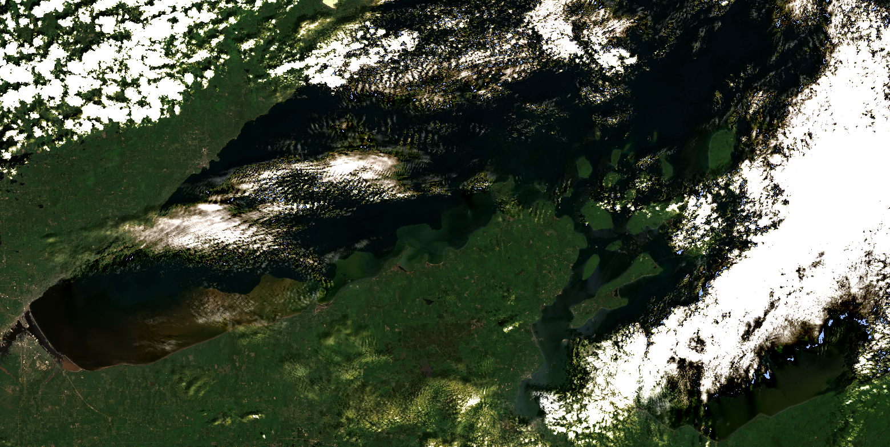
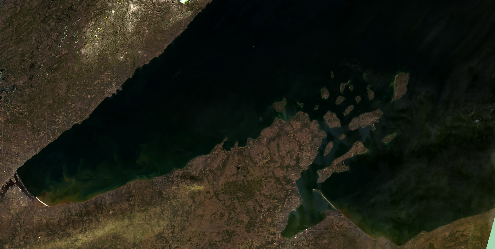
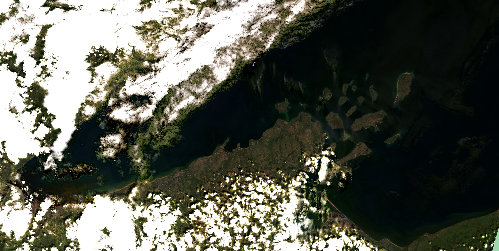

```{r setup, echo = F, message = FALSE}
# keep things quiet
knitr::opts_chunk$set(message = FALSE, error = FALSE, warning = FALSE, fig.dim = c(4,4))

# get all the functions from the src folder and load them
source_files <- list.files("src", full.names = T)
invisible(lapply(source_files, source))
# and the funcs for this analysis
analysis_funcs <- list.files("modeling/src", full.names = T)
invisible(lapply(analysis_funcs, source))
# list/load/download the packages needed for this script
packages <- c('rstatix',
              'tidyverse',
              'ggthemes',
              'GGally',
              'knitr')
invisible(lapply(packages, package_loader))
```

# Purpose

This script takes a deep dive into Landsat 9 labels for a more rigorous analysis
of inconsistent band data and outliers in the filtered label dataset. Here we
will determine if any more label data points should be removed from the training
dataset and whether or not we can glean anything from the metadata in the
outlier dataset to be able to pre-emptively toss out scenes when we go to apply
the classification algorithm.

```{r}
harmonize_version = "v2024-04-17"
outlier_version = "v2024-04-17"

LS9 <- read_rds(paste0("data/labels/harmonized_LS89_labels_", harmonize_version, ".RDS")) %>% 
  filter(mission == "LANDSAT_9")
```

## Check for mis-matched band data between user data and re-pull

Just look at the data to see consistent (or inconsistent) user-pulled data and
our pull, here, our user data are in "BX" format and the re-pull is in "SR_BX"
format. These are steps to assure data quality if the volunteer didn't follow
the directions explicitly.

```{r}
pmap(.l = list(user_band = LS89_user,
               ee_band = LS89_ee,
               data = list(LS9),
               mission = list("LANDSAT_9")),
     .f = make_band_comp_plot)
```

There isn't a ton of mis-match here, we'll just use B7/SR_B7 as a reference to
filter inconsistent labels

```{r}
LS9_inconsistent <- LS9 %>% 
  filter((is.na(SR_B7) | SR_B7 != B7))

LS9_inconsistent %>% 
  group_by(class) %>% 
  summarise(n_labels = n()) %>% 
  kable()
```

Not much to report, we can just drop these few inconsistent band values.

```{r}
LS9_filtered <- LS9 %>% 
  filter(# filter data where SR_B7 has data and where the values match between the two
         # pulls.
         (!is.na(SR_B7) & SR_B7 == B7) | 
           # or where the user-specified class is cloud and the pixel was saturated
           # providing no surface refelctance data in the re-pull
           (class == "cloud" & is.na(SR_B7)),
         # or where any re-pulled band value is greater than 1, which isn't a valid value
         if_all(LS89_ee,
                ~ . <= 1))
```

And plot:

```{r, echo=FALSE}
pmap(.l = list(user_band = LS89_user,
               ee_band = LS89_ee,
               data = list(LS9_filtered),
               mission = list("LANDSAT_9")),
     .f = make_band_comp_plot)
```

Looks good!

And now let's look at the data by class:

```{r, echo=FALSE}
pmap(.l = list(data = list(LS9_filtered),
               data_name = list("LANDSAT_9"),
               band = LS89_ee),
     .f = make_class_comp_plot)
```

We aren't actually modeling "other" (not sufficient observations to classify) or
"shorelineContamination" (we'll use this later to block areas where there is
likely shoreline contamination in the AOI).

```{r}
LS9_for_class_analysis <- LS9_filtered %>% 
  filter(!(class %in% c("other", "shorelineContamination")))
```

```{r, echo=FALSE}
pmap(.l = list(data = list(LS9_for_class_analysis),
               data_name = list("LANDSAT_9"),
               band = LS89_ee),
     .f = make_class_comp_plot)
```

Interesting - the classes look really similar in distribution (maybe because
cloud categories are so high). It will be interesting to see if there are
statistical differences.

## Outlier handling

There are statistical outliers within this dataset and they may impact the
interpretation of any statistical testing we do. Let's see if we can narrow down
when those outliers and/or glean anything from the outlier data that may be
applicable to the the application of the algorithm. Outliers may be a systemic
issue (as in the scene is an outlier), it could be a user issue (a user may have
been a bad actor), or they just might be real. This section asks those
questions. The "true outliers" that we dismiss from the dataset will also be
used to help aid in interpretation/application of the algorithm across the
Landsat stack, so it is important to make notes of any patterns we might see in
the outlier dataset.

```{r, echo=FALSE}
vertical_data <- LS9_for_class_analysis %>% 
  pivot_longer(LS89_ee,
             names_to = "band_name",
             values_to = "value") %>% 
  rowid_to_column()
vert_out <- vertical_data %>% 
  select(user_label_id, rowid, date, class, band_name, value, vol_init) %>% 
  group_by(class, band_name) %>% 
  identify_outliers(., value) %>% 
  filter(is.extreme)
outliers <- vert_out  %>% 
  left_join(vertical_data) %>%
  select(-rowid)%>% 
  pivot_wider(names_from = band_name,
              values_from = value,
              values_fn = max)

print("Classes represented in outliers:")
unique(outliers$class)
```

Okay, `r nrow(outliers)` outliers (\>1.5\*IQR) out of
`r nrow(LS9_for_class_analysis)` - and they are all from non-cloud groups, and
non of them are light near shore sediment.

How many of these outliers are in specific scenes?

```{r}
LS9_out_date <- outliers %>% 
  group_by(date, vol_init) %>% 
  summarize(n_out = n())
LS9_date <- LS9_for_class_analysis %>% 
  filter(class != "cloud") %>% 
  group_by(date, vol_init) %>% 
  summarise(n_tot = n())
LS9_out_date <- left_join(LS9_out_date, LS9_date) %>% 
  mutate(percent_outlier = n_out/n_tot*100) %>% 
  arrange(-percent_outlier)
LS9_out_date %>% 
  kable()
```

There is just one scene with a high proportion of ouliers - perhaps there is
something about the AC in these particular scenes? or the general scene quality?

```{r}
LS9_out_date %>% 
  filter(percent_outlier > 20) %>% 
  select(date, vol_init) %>% 
  left_join(., LS9) %>% 
  select(date, vol_init, DATA_SOURCE_AIR_TEMPERATURE:max_cloud_cover) %>% 
  distinct() %>% 
  kable()
```

Image quality is high and cloud cover is reasonable. Let's look at that image:



This does indeed look a bit hazy, but there are some really interesting offshore
sediment plumes here. Hard to tell if the color is in any way due to aerosol contamination,
though.

Let's look at instances where outliers are in at least three bands for a given
label:

```{r, echo = FALSE}
vert_out %>%
  group_by(date, class, vol_init, user_label_id) %>% 
  summarise(n_bands_out = n(),
            bands_out = paste(band_name, collapse = "; ")) %>% 
  filter(n_bands_out >= 3) %>% 
  arrange(-n_bands_out) %>% 
  kable()
```

These are from the same scene. Let's see if it shows up in our QA summaries.

### QA Pixels

Do any of the labels have QA pixel indications of cloud or cloud shadow? The
first pass here is for all data that don't have a label of "cloud" (not just
outliers). Let's see if the low certainty classification in the QA band is
useful here (there is no medium certainty for LS8/9)

```{r}
LS9_for_class_analysis %>% 
  mutate(QA = case_when(str_sub(QA_PIXEL_binary, 1, 2) %in% c(01, 11)  ~ "cirrus",
                   str_sub(QA_PIXEL_binary, 3, 4) %in% c(01, 11)  ~ "snow/ice",
                   str_sub(QA_PIXEL_binary, 5, 6) %in% c(01, 11)  ~ "cloud shadow",
                   str_sub(QA_PIXEL_binary, 7, 8) %in% c(01, 11)  ~ "cloud",
                   TRUE ~ "clear")) %>% 
  group_by(QA) %>% 
  filter(class != "cloud") %>% 
  summarize(n_tot = n()) %>% 
  kable()
```

Low confidence is much better than medium confidence in LS8 than 5/7 - let's
check to see that the classes are the same for high confidence:

```{r}
LS9_for_class_analysis %>% 
  mutate(QA = case_when(str_sub(QA_PIXEL_binary, 1, 2) == 11 ~ "cirrus",
                   str_sub(QA_PIXEL_binary, 3, 4) == 11 ~ "snow/ice",
                   str_sub(QA_PIXEL_binary, 5, 6)  == 11 ~ "cloud shadow",
                   str_sub(QA_PIXEL_binary, 7, 8)  == 11 ~ "cloud",
                   TRUE ~ "clear")) %>% 
  group_by(QA) %>% 
  filter(class != "cloud") %>% 
  summarize(n_tot = n()) %>% 
  kable()
```

They are the same! Let's look at the cirrus group to see if there is anything
egregious:

```{r}
LS9_for_class_analysis %>% 
  filter(str_sub(QA_PIXEL_binary, 1, 2) == 11, 
         class != "cloud") %>% 
  group_by(date, vol_init) %>% 
  summarise(n_cirrus = n()) %>% 
  arrange(-n_cirrus) %>% 
  kable()
```

Let's look at this scene - there are 8 labels (that aren't clouds) that have a
cirrus flag:



This is quite hazy in the SE corner of the AOI, near the Apostles. While we can 
keep this scene since it is otherwise clear, we will again trust the QA bit to 
remove high aerosol pixels.

### Clouds

How many of these outliers have near-pixel clouds (as measured by ST_CDIST)?

```{r, echo = FALSE}
LS9_out_CDIST <- outliers %>% 
  filter(class != "cloud" & ST_CDIST < 50) 
# compared with the whole dataset 
LS9_CDIST <- LS9_for_class_analysis %>% 
  filter(class != "cloud" & ST_CDIST < 50)
```

There are `r nrow(LS9_out_CDIST)` labels
(`r round(nrow(LS9_out_CDIST)/nrow(outliers)*100, 1)`% of oultiers) that aren't
"cloud" in the outlier dataset that have a cloud distance \<500m and
`r nrow(LS9_CDIST)` labels
(`r round(nrow(LS9_CDIST)/nrow(LS9_for_class_analysis)*100, 1)`%) in the whole
dataset that have a cloud distance \<500m. This is unhelpful.

How many of the outliers have high cloud cover, as reported by the scene-level
metadata? Note, we don't have the direct scene cloud cover associated with
individual labels, rather a list of the scene level cloud cover values
associated with the AOI.

```{r, echo = FALSE}
# max
LS9_out_max_cloud <- outliers %>% 
  rowwise() %>% 
  filter(max_cloud_cover > 75) 
# compared with the whole dataset 
LS9_max_cloud <- LS9_for_class_analysis %>% 
  rowwise() %>% 
  filter(class != "cloud" & max_cloud_cover > 75) 

# mean
LS9_out_mean_cloud <- outliers %>% 
  rowwise() %>% 
  filter(mean_cloud_cover > 60) 
# compared with the whole dataset 
LS9_mean_cloud <- LS9_for_class_analysis %>% 
  rowwise() %>% 
  filter(class != "cloud" & mean_cloud_cover > 60) 
```

The outlier dataset contains `r nrow(LS9_out_max_cloud)`
(`r round(nrow(LS9_out_max_cloud)/nrow(outliers)*100, 1)`%) where the max cloud
cover was \> 75% and `r nrow(LS9_out_mean_cloud)`
(`r round(nrow(LS9_out_mean_cloud)/nrow(outliers)*100, 1)`%) where the mean
cloud cover was \> 50%. The filtered dataset contains `r nrow(LS9_max_cloud)`
(`r round(nrow(LS9_max_cloud)/nrow(LS9_for_class_analysis)*100, 1)`%) where max
was \>75% and `r nrow(LS9_mean_cloud)`
(`r round(nrow(LS9_mean_cloud)/nrow(LS9_for_class_analysis)*100, 1)`%) where the
mean cloud cover was \> 50%. This is also unhelpful.

### RadSat QA bit

Pixels can also be saturated in one or more bands, we need to make sure that the
QA_RADSAT for all labels (including clouds) are set to zero. During the re-pull,
we masked satruated pixels, so this should be zero.

```{r}
LS9_for_class_analysis %>% 
  mutate(radsat = if_else(QA_RADSAT == 0,
                           "n",
                           "y")) %>% 
  group_by(radsat) %>% 
  summarize(n_tot = n()) %>% 
  kable()
```

Great! No bands are saturated!

### Aerosol QA bit

Landsat 9 and 9 feature an Aerosol QA band, derived from Band 1. We should look
through the data here to see if any of the labels are in high aerosol QA pixels,
which the USGS suggests should not be used.

```{r}
LS9_for_class_analysis %>% 
  mutate(aerosol = if_else(str_sub(SR_QA_AEROSOL_binary, 1, 2) == 11,
                           "y",
                           "n")) %>% 
  group_by(aerosol) %>% 
  filter(class != "cloud") %>% 
  summarize(n_tot = n()) %>% 
  kable()
```

And let's look to see when the instances of high aerosol are:

```{r}
LS9_for_class_analysis %>% 
  filter(str_sub(SR_QA_AEROSOL_binary, 1, 2) == 11) %>% 
  group_by(date) %>% 
  filter(class != "cloud") %>% 
  summarize(n_tot = n()) %>% 
  arrange(-n_tot) %>% 
  kable()
```

We already know that the scenes 2022-05-05 and 2022-06-06 have been flagged, let's
also look at 2022-05-21:



Well, some of the scene is pretty clear, but there is some of the green-cloud 
artifact of high aerosol evident in this scene. 

I'm also interested in the scene quality here:

```{r}
LS9_for_class_analysis %>% 
  filter(date == "2022-05-21") %>% 
  pluck("IMAGE_QUALITY_OLI_list") %>% 
  unique() %>% 
  unlist()
```

As with other instances, IMAGE QUALITY is high. Since there is quite a bit of this
scene that is clear, I'm again going to trust the QA bits. 

### Training dataset implications

For the purposes of training data, we are going to throw out the the high aerosol 
and cirrus flags

```{r}
LS9_training_labels <- LS9_for_class_analysis %>% 
  # drop the labels with cirrus contamination and high aerosol
  filter(!(str_sub(QA_PIXEL_binary, 1, 2) == 11),
         # drop all the labels with high aerosol, unless the class is cloud
         (str_sub(SR_QA_AEROSOL_binary, 1, 2) != 11 | class == "cloud"))
```

## Testing for inter-class differences

We do want to have an idea of how different the classes are, in regards to band
data. While there are a bunch of interactions that we could get into here, for
the sake of this analysis, we are going to analyze the class differences by
band.

Kruskal-Wallis assumptions:

1)  Data are non-Normal or have a skewed distribution
2)  There must be at least two independent groups.
3)  Data have a similar distribution across groups.
4)  Data are independent, the groups shouldn't have a relationship to one
    another
5)  Each group should contain at least 5 observations

ANOVA assumptions:

1)  data are distributed normally
2)  data are independent
3)  variance across groups is similar

We can't entirely assert sample independence and we know that variance and
distribution is different for "cloud" labels, but those data also are visibly
different from the other classes.

In order to systematically test for differences between classes and be able to
intepret the data, we will need to know some things about our data:

1)  Are the data normally distributed (Shapiro-Wilkes)?
2)  Are there outliers that may impact interpretation?
3)  If data is non-normal, perform Kruskal-Walis test; otherwise ANOVA
4)  if the null is rejected (and there is a difference in at least one class),
    perform post-hoc test for pairwise comparison (Dunn test for both)

With this workflow, most classes are statistically different - below are the
cases where the pairwise comparison were not deemed statistically significant:

```{r, echo = FALSE}
LS89_band_sym = syms(LS89_ee)

LS9_class_analysis <- pmap(.l = list(dataset = list(LS9_training_labels),
                                     band = LS89_band_sym,
                                     class_col = list(sym("class"))),
                           .f = test_class_sig)
names(LS9_class_analysis) <- LS89_ee

map(LS9_class_analysis,
    function(band) {
      band$pairwise_difference %>% 
        filter(p.adj.signif == "ns")
    }
  ) %>% 
  list_rbind() %>% 
  rename(band = .y.)
```

This is arguably worse than LS8. I think part of the issue for 8 and 9 may be 
a quantity issue.

```{r, echo=FALSE, fig.dim=c(10,10), fig.cap="DNSS: dark near shore sediment, LNSS: light near shore sediment, OSS: offshore sediment"}
LS9_training_labels %>% 
  mutate(class_short = case_when(class == "darkNearShoreSediment" ~ "DNSS",
                                 class == "lightNearShoreSediment" ~ "LNSS",
                                 class == "offShoreSediment" ~ "OSS",
                                 TRUE ~ class)) %>% 
ggpairs(., columns = LS89_ee, aes(color = class_short)) + 
  scale_color_colorblind() +
  scale_fill_colorblind() +
  theme_few()
```

There are definitely some varying patterns here, let's zoom in on the sediment
classes.

```{r, echo=FALSE, fig.dim=c(8,8), fig.cap="DNSS: dark near shore sediment, LNSS: light near shore sediment, OSS: offshore sediment"}
LS9_training_labels %>% 
  mutate(class_short = case_when(class == "darkNearShoreSediment" ~ "DNSS",
                                 class == "lightNearShoreSediment" ~ "LNSS",
                                 class == "offShoreSediment" ~ "OSS",
                                 TRUE ~ class)) %>% 
  filter(grepl("Sediment", class) | class == "openWater") %>% 
ggpairs(., columns = LS89_ee, aes(color = class_short)) + 
  scale_color_colorblind() +
  scale_fill_colorblind() +
  theme_few()
```

Arguably not as scatter shot bad as LS8, but still might be tough to distinguish 
between classes.

### Aggregating sediment classes and performing statistical tests

As a back up, we should consider using aggregated sediment classes, where any 
label of sediment is treated as a general class of "sediment". Let's do the same 
process here to test for class significance.

```{r, echo = FALSE}
LS9_training_labels <- LS9_training_labels %>% 
  mutate(agg_class = if_else(grepl("Sediment", class),
                             "sediment",
                             class))

LS9_class_analysis_aggregated <- pmap(.l = list(dataset = list(LS9_training_labels),
                                     band = LS89_band_sym,
                                     class_col = list(sym("agg_class"))),
                           .f = test_class_sig)
names(LS9_class_analysis_aggregated) <- LS89_ee

map(LS9_class_analysis_aggregated,
    function(band) {
      band$pairwise_difference %>% 
        filter(p.adj.signif == "ns")
    }
  ) %>% 
  list_rbind() %>% 
  rename(band = .y.)
```

And let's look at the scatter plots here:

```{r, echo=FALSE, fig.dim=c(10,10)}
LS9_training_labels %>% 
ggpairs(., columns = LS89_ee, aes(color = agg_class)) + 
  scale_color_colorblind() +
  scale_fill_colorblind() +
  theme_few()
```

And if we drop the cloud:

```{r}
LS9_training_labels %>% 
  filter(agg_class != "cloud") %>% 
ggpairs(., columns = LS89_ee, aes(color = agg_class)) + 
  scale_color_colorblind() +
  scale_fill_colorblind() +
  theme_few()
```

These seem pretty recognizable in visible band space. 

## Export the training labels

Things to note for Landsat 9:

-   classes are less differentiable statistically within bands than LS5 and 7 -
    need to be thoughtful about this when applying the models. This may require
    more post-hoc testing to add certainty to output.
-   bright cloud cover and snow may impact Rrs within the waterbody leading to
    outliers. will need to be cautious applying the algo when snow is on the
    ground!
-   must mask high aerosol pixels, as they will get labeled as something else
    entirely.
-   We may need to aggregate the sediment into a single class for reliable results

```{r}
write_rds(LS9_training_labels, paste0("data/labels/LS9_labels_for_tvt_", outlier_version, ".RDS"))
```
